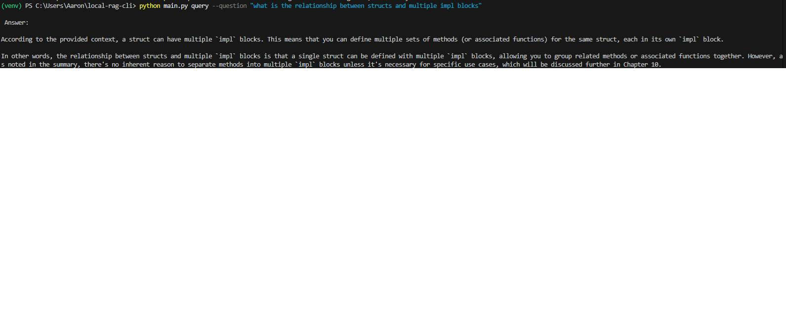

# local-rag-cli

To Run:
- Ollama must be running llama3.1:8b
to index the files (run initially):
python main.py index --folder ./my-pdf-folder
to query the indexed files:
python main.py query --question "What is a good question for your specific PDFs?"

